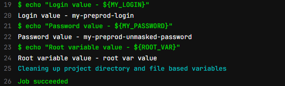
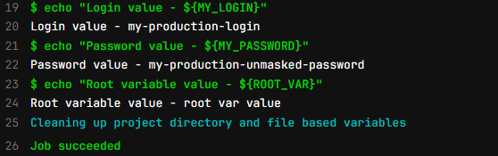

# Урок 3. Continuous delivery и continuous deployment (непрерывная доставка и развертывание)

## Задание:
Добавить 2 окружения "preprod" и "production".  
Добавить отдельные deploy job для каждой среды.  
Добавить переменную "$MyLogin" внутри .gitlab-ci.yml, которая будет меняться в зависимости от среды.  
Добавить переменную "$MyPassword" не используя .gitlab-ci.yml, которая так же будет меняться в зависимости от среды.
Добавить скрипт в .gitlab-ci.yml, который найдёт все запущенные pipeline по названии ветки(ref) и остановит их.

# Решение:

## Файл `.gitlab-ci.yml`

```
image: busybox:latest

stages:
  - test
  - deploy
  - stop
  - stop previous jobs

variables:
  ROOT_VAR: root var value

test:
  stage: test
  script:
    - echo $ROOT_VAR
    - echo ${ROOT_VAR}
    - echo "Test $ROOT_VAR"
    - echo "Test ${ROOT_VAR}"

preprod deploy:
  stage: deploy
  variables:
    MY_LOGIN: my-preprod-login
  script:
    - echo "Login value - ${MY_LOGIN}"
    - echo "Password value - ${MY_PASSWORD}"
    - echo "Root variable value - ${ROOT_VAR}"
  only:
    - main
  environment:
    name: preprod

production deploy:
  stage: deploy
  variables:
    MY_LOGIN: my-production-login
  script:
    - echo "Login value - ${MY_LOGIN}"
    - echo "Password value - ${MY_PASSWORD}"
    - echo "Root variable value - ${ROOT_VAR}"
  only:
    - main
  environment:
    name: production

cancel:
  stage: stop previous jobs
  image: everpeace/curl-jq
  script:
    - |
      if [ "$CI_COMMIT_REF_NAME" == "main" ]
        then
          (
            echo "Cancel old pipelines from the same branch except last"
            OLD_PIPELINES=$( curl -s -H "PRIVATE-TOKEN: $RUNNER_TOKEN" "https://gitlab.com/api/v4/projects/${CI_PROJECT_ID}/pipelines?ref=${CI_COMMIT_REF_NAME}&status=running" \
                  | jq '.[] | .id' | tail -n +2 )
                  for pipeline in ${OLD_PIPELINES}; \
                      do echo "Killing ${pipeline}" && \
                        curl -s --request POST -H "PRIVATE-TOKEN: ${RUNNER_TOKEN}" "https://gitlab.com/api/v4/projects/${CI_PROJECT_ID}/pipelines/${pipeline}/cancel"; done
          ) || echo "Canceling old pipelines (${OLD_PIPELINES}) failed"
      fi
```

## Результат `preprod deploy`:



## Результат `production deploy`:


